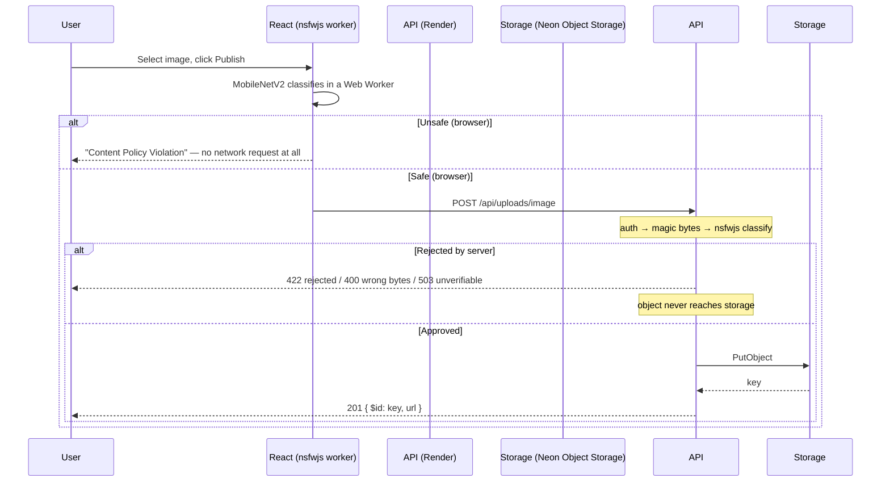

# 🛡️ Image Moderation Architecture

GoodPost moderates images in **two layers**: a fast browser-side check for instant feedback, and
an authoritative server-side check that cannot be bypassed.

The browser check alone is not enough — anyone can `POST` straight to `/api/uploads/image`. The
API is therefore the source of truth: **an image is only written to public storage after it has
been classified and approved server-side.**

## 🏗️ 1. Flow


```mermaid
sequenceDiagram
    participant User
    participant React (nsfwjs worker)
    participant API (Render)
    participant Storage (Neon Object Storage)

    User->>React (nsfwjs worker): Select image, click Publish
    React (nsfwjs worker)->>React (nsfwjs worker): MobileNetV2 classifies in a Web Worker
    alt Unsafe (browser)
        React (nsfwjs worker)-->>User: "Content Policy Violation" — no network request at all
    else Safe (browser)
        React (nsfwjs worker)->>API: POST /api/uploads/image
        Note over API: auth → magic bytes → nsfwjs classify
        alt Rejected by server
            API-->>User: 422 rejected / 400 wrong bytes / 503 unverifiable
            Note over API: object never reaches storage
        else Approved
            API->>Storage: PutObject
            Storage-->>API: key
            API-->>User: 201 { $id: key, url }
        end
    end
```

## 🧱 2. Layers

### Layer 1 — Browser (`src/hooks/useNSFW.js` + `src/workers/nsfwWorker.js`)

Runs `nsfwjs` in a Web Worker so the main thread never blocks. Blocks the upload before a single
byte of network traffic is spent, and gives instant feedback. Uses the same thresholds as the
server so the two never disagree.

### Layer 2 — API (`server/src/moderation.js`) — authoritative

Runs on every upload, before the object is stored:

1. **Magic-byte sniffing** (`server/src/mime.js`) — the bytes must actually be the declared type.
   A renamed executable or an `.svg` full of scripts never gets to the model.
2. **Decode** — `sharp` resizes to 224×224 (honouring EXIF rotation), capped at 40 MP so a
   decompression bomb can't exhaust memory.
3. **Classify** — `nsfwjs` MobileNetV2 → `Porn` / `Hentai` / `Sexy` / `Neutral` / `Drawing`.
4. **Verdict** — `server/src/moderationPolicy.js` (pure, unit-tested) applies the thresholds.
5. **Store** — only approved images are written to Neon Object Storage.

## 📊 3. Measured cost

Numbers from this machine, pure-JS TensorFlow (`@tensorflow/tfjs`, no native bindings):

| Metric | Value |
| --- | --- |
| Model load (boot, once) | ~3.5 s |
| Resident memory after load | ~160 MB |
| Inference per image | ~3–4 s |
| Render free tier budget | 512 MB ✅ |

The model is preloaded at boot (`warmModeration()`), so the first upload isn't slow and a broken
CDN shows up in the startup log rather than in a user's request.

> Inference is CPU-bound and deliberately not native. If latency becomes a problem, installing
> `@tensorflow/tfjs-node` speeds it up dramatically at the cost of a much heavier build. The
> swap is contained to `server/src/moderation.js`.

## ⚙️ 4. Configuration

| Variable | Default | Meaning |
| --- | --- | --- |
| `MODERATION_ENABLED` | `true` | Turn the server-side check off entirely |
| `MODERATION_FAIL_POLICY` | `closed` | `closed` = refuse unverifiable uploads (503); `open` = allow them |
| `MODERATION_PORN_THRESHOLD` | `0.7` | Block above this probability |
| `MODERATION_HENTAI_THRESHOLD` | `0.7` | Block above this probability |
| `MODERATION_SEXY_THRESHOLD` | `0.8` | Block above this probability |
| `MODERATION_MODEL_URL` | nsfwjs CDN | Self-hosted model location |

Thresholds are **exclusive**: a value of exactly `0.7` passes, `0.71` blocks.

`failPolicy=closed` is the default because moderation is a safety control — publishing an
unverified image is worse than making the user retry. Set it to `open` if you'd rather keep
uploads working during a CDN outage.

## 🧪 5. Verifying it

```bash
# unit tests for the verdict logic and the byte sniffer
npm --prefix server test

# live check: a real image is approved, an unreadable one is refused (fail-closed)
node --input-type=module -e '
import { readFileSync } from "node:fs";
import { moderateImage } from "./server/src/moderation.js";
console.log(await moderateImage(readFileSync("public/GoodPost.jpeg")));
console.log(await moderateImage(Buffer.from("<html>not an image</html>")));
'
```

The admin dashboard (`/admin` → **System**) reports moderation readiness, the active fail policy,
how many images have been blocked, and the upload counters.

## 💡 6. Why not the alternatives?

- **Client-side only** — free and instant, but trivially bypassed by calling the upload endpoint
  directly. Kept as layer 1 for speed, never trusted on its own.
- **A separate ML service** — an extra deployment to build, host, keep awake, and pay for. The
  model fits in the API we already run, so there is nothing extra to operate.
- **A hosted moderation API** (Google Vision SafeSearch, etc.) — more accurate and zero memory
  overhead, but adds per-image cost and an external dependency. Worth revisiting if accuracy or
  latency becomes the constraint.
